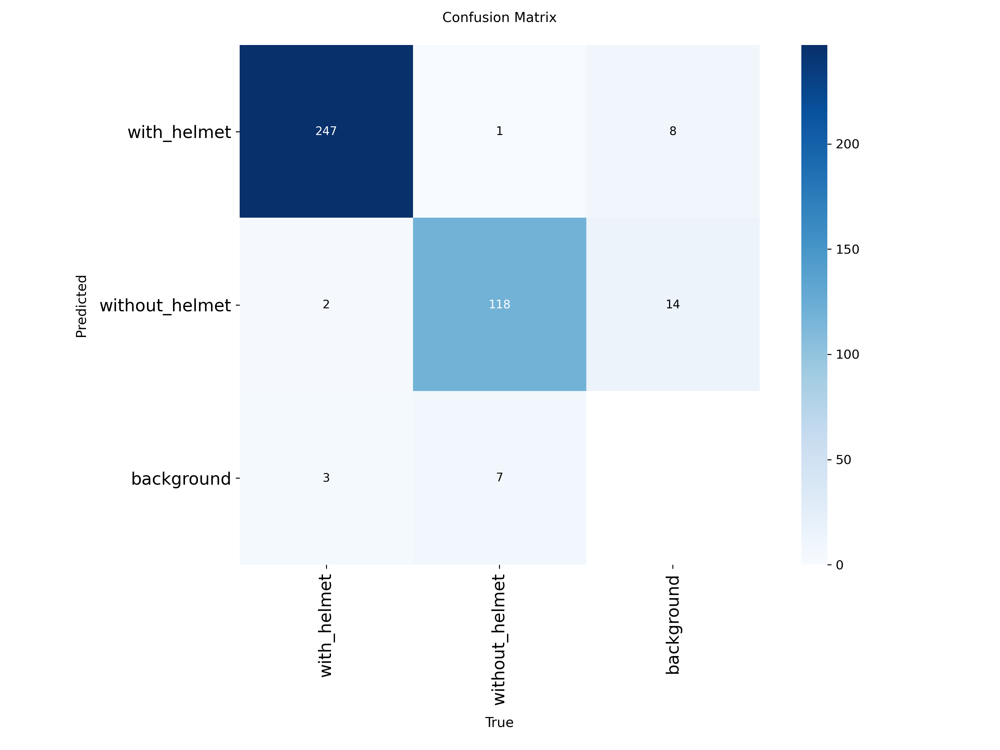
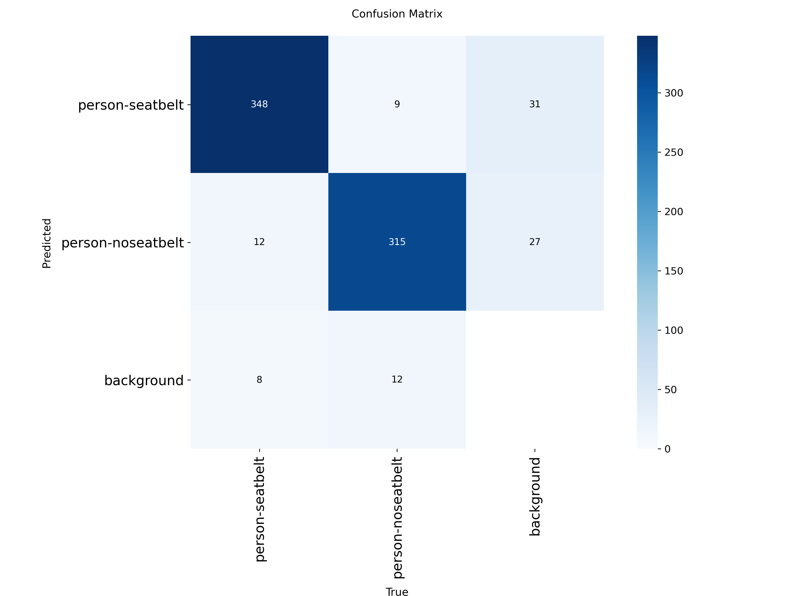
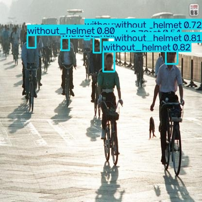
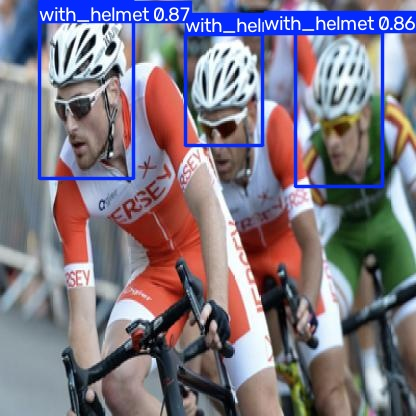
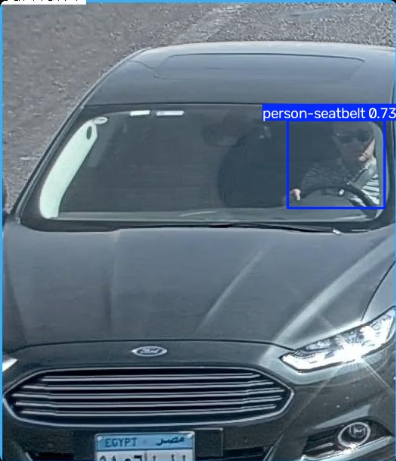
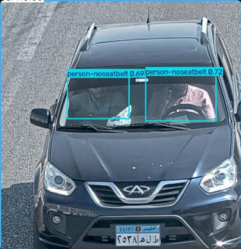

# Helmet & Seatbelt Detection

YOLO-based Streamlit app for detecting helmet usage and seatbelt usage in uploaded images.

🔗 **Live demo: https://helmet-seatbelt-detection-gjmfst63aud9j4yvonktrp.streamlit.app/
## Project structure

```
helmet-seatbelt-detection/
├── app.py                 
├── requirements.txt
├── models/
│   ├── helmet_model.pt    
│   └── seatbelt_model.pt
└── README.md
```

## Running locally

```bash
pip install -r requirements.txt
streamlit run app.py
```

## Model weights

`models/helmet_model.pt` and `models/seatbelt_model.pt` are trained YOLOv8 checkpoints
(not included in git if they exceed GitHub's size limits — see below).

- If each file is **under ~100MB**, just add them to the repo normally.
- If either is **larger**, use [Git LFS](https://git-lfs.com/):
  ```bash
  git lfs install
  git lfs track "*.pt"
  git add .gitattributes
  ```
- Alternatively, host the weights on a GitHub Release or Hugging Face Hub and
  download them at startup instead of committing them.

## Deploying (Streamlit Community Cloud)

1. Push this repo to GitHub (public).
2. Go to [share.streamlit.io](https://share.streamlit.io), sign in with GitHub.
3. Select this repo, branch `main`, main file path `app.py`.
4. Deploy. You'll get a permanent public URL viewers can open directly.

Note: the free tier has ~1GB RAM and no GPU, so inference is slower than on Colab,
and the app cold-starts after periods of inactivity.

## Dataset

- **Helmet dataset:** classes `with_helmet` / `without_helmet` — 1,531 training images, 138 validation images
- **Seatbelt dataset:** classes `person-seatbelt` / `person-noseatbelt` — 4,680 training images, 530 validation images
- Class imbalance was addressed with augmentation (Albumentations for helmet data,
  Keras `ImageDataGenerator` for seatbelt data) on the minority class before training.
- Images were split into `train`/`val` (80/20) after balancing.

## Training

Both models are YOLOv8, fine-tuned with `ultralytics`:

| Model | Base weights | Epochs | Image size | Training time |
|---|---|---|---|---|
| Helmet detector | yolov8m.pt | 40 | 640 | 0.58 hrs (Tesla T4) |
| Seatbelt detector | yolov8s.pt | 15 | 640 | 0.41 hrs (Tesla T4) |

The full training pipeline (dataset prep, XML→YOLO label conversion, class balancing,
`.train()` calls) lives in [`training/Helmet_Seatbelt_Detection.ipynb`](training/Helmet_Seatbelt_Detection.ipynb)
and is not part of the deployed app.

## Results

Final validation metrics (best checkpoint of each run):

| Model | Precision | Recall | mAP50 | mAP50-95 |
|---|---|---|---|---|
| Helmet detector (overall) | 0.965 | 0.929 | 0.977 | 0.704 |
| — with_helmet | 0.981 | 0.972 | 0.993 | 0.724 |
| — without_helmet | 0.949 | 0.886 | 0.962 | 0.684 |
| Seatbelt detector (overall) | 0.922 | 0.936 | 0.968 | 0.648 |
| — person-seatbelt | 0.927 | 0.951 | 0.978 | 0.658 |
| — person-noseatbelt | 0.917 | 0.921 | 0.959 | 0.639 |

Inference speed (Tesla T4, per image): helmet detector ~11.1ms, seatbelt detector ~7.2ms
(CPU inference on Streamlit Cloud's free tier will be slower).

Confusion matrices (regenerated via `model.val()` on the trained weights):




Sample detections:





